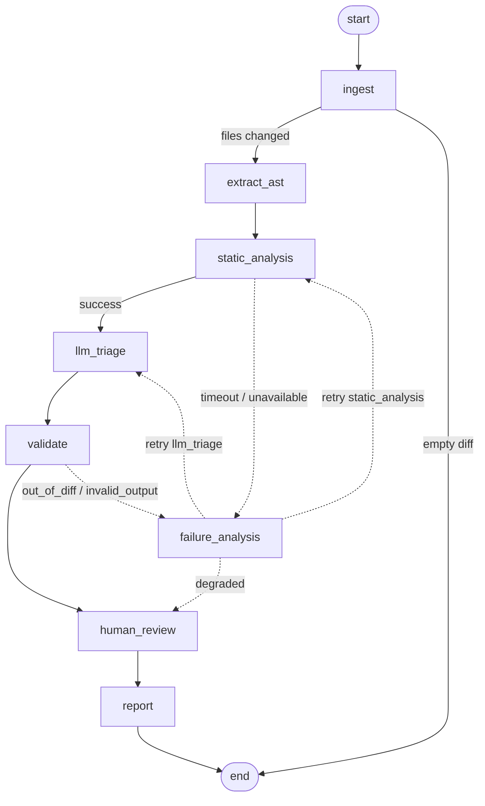

# Helps you ship faster 🚢

CodeSentinel is an extendable code-review agent. It runs an agent loop that reads your diff, explores the codebase with real developer tools, and posts focused review comments — picking up issues a human reviewer would, such as:

- Exposed secrets
- Slow or inefficient code
- Potential bugs or unhandled edge cases

CodeSentinel can also act as a Model Context Protocol (MCP) client to reach external tools like browser automation, observability and documentation.

## Demo

https://github.com/user-attachments/assets/code-review-gpt-3.mp4

## Ethos 💭

- **A prebuilt review workflow, not a bespoke CLI** — the agent loop runs on flue + pi.
- **Runs anywhere**: Node, Cloudflare, GitHub Actions, GitLab CI.
- **Functions as a human code reviewer**, using flue's built-in tools instead of a hand-rolled tool registry.
- **Provider-agnostic**: Anthropic, OpenAI, OpenRouter, and Cloudflare Workers AI out of the box.
- **Acts as an MCP client** for integration with external tools.

---

## Quick start 🚀

### GitHub Action

Scaffold CodeSentinel into your repo with `npx CodeSentinel init`, then add your provider API key as a repo secret.

```yaml
# .github/workflows/CodeSentinel.yml
name: CodeSentinel

on:
  pull_request:

permissions:
  pull-requests: write
  contents: read

jobs:
  review:
    runs-on: ubuntu-latest
    steps:
      - uses: actions/checkout@v4
        with:
          fetch-depth: 0
      - uses: ancientdev0x/CodeSentinel@v0
        env:
          GITHUB_TOKEN: ${{ secrets.GITHUB_TOKEN }}
          ANTHROPIC_API_KEY: ${{ secrets.ANTHROPIC_API_KEY }}
```

### Local Review

Review staged changes (`git diff --cached`) locally with zero server setup:

```bash
npx CodeSentinel review
```

---

## Architecture & Review Engine ⚙️

CodeSentinel orchestrates code reviews through a cyclic, stateful [LangGraph](https://github.com/langchain-ai/langgraphjs) engine. Instead of a single brittle prompt, review execution progresses through isolated stages with deterministic analyzers, LLM triage, strict diff validation, and self-correcting retry cycles.



| Stage | Node | Description |
|---|---|---|
| **1. Ingest** | `ingest` | Clones PR / fetches diff (`git diff`), caps diff size (max 300 files), extracts modified line intervals. |
| **2. AST Extraction** | `extract_ast` | Parses language syntax trees via `ast-grep` (NAPI) and runs structural security pattern checks. |
| **3. Static Analysis** | `static_analysis` | Executes Bandit (AST security), Ruff (linter/security rules), and `tsc` in network-less Docker sandboxes. |
| **4. LLM Triage** | `llm_triage` | Filters detector false alarms, confirms real vulnerabilities, and identifies subtle logic regressions. |
| **5. Validation** | `validate` | Enforces that all reported findings land strictly within the modified diff range and have valid line numbers. |
| **6. Failure Analysis** | `failure_analysis` | Inspects stage errors (timeouts, validation failures) and routes into bounded self-healing retry cycles. |
| **7. Human Review** | `human_review` | Generates unified diff patches (`.patch`) validated with `git apply --check` and handles HITL interrupts. |
| **8. Reporting** | `report` | Publishes formatted markdown summaries and inline suggestion comments to GitHub or local files. |

---

## Core Features & Usage 🛠️

### 1. Ingest Public or Private PR URLs
Review any GitHub pull request directly by URL without manual checkout:

```bash
npx CodeSentinel review --pr https://github.com/owner/repo/pull/123
```

CodeSentinel clones the PR head into an ephemeral temporary directory, resolves the base SHA, reviews the diff, and cleans up after execution.

### 2. AST Pattern Matching & Structural Security Rules
CodeSentinel uses `@ast-grep/napi` to parse code into abstract syntax trees and match structural security anti-patterns across Python and TypeScript:
- `py-eval-exec`: Unsafe dynamic execution (`eval()`, `exec()`) [CWE-95]
- `py-sql-concat`: Raw SQL string concatenation and formatted queries [CWE-89]
- `py-subprocess-shell`: Subprocess execution with `shell=True` [CWE-78]
- `py-pickle-loads`: Insecure deserialization via `pickle.loads()` [CWE-502]
- `py-yaml-unsafe`: Insecure YAML loading without `SafeLoader` [CWE-502]
- `ts-eval`: Unsafe `eval()` or `new Function()` in TypeScript [CWE-95]
- `ts-child-exec-template`: Unsanitized command injection in template literals [CWE-78]

**Adding Custom Rules:** Simply place a new YAML rule in `src/review/ast/rules/<rule-id>.yml`. Rules define an AST `pattern`, language (`python` or `typescript`), `message`, and `cwe`.

### 3. Sandboxed Static Analyzers (Docker & Timeout Isolation)
Static analyzers (Bandit 1.8.3, Ruff 0.9.10, and TypeScript 5.8.2) run in a hardened, network-less Docker container (`codesentinel-analyzers:0.1.0`):
- **Isolation Flags:** `--network none`, `--read-only`, `--cap-drop all`, `--user 10001:10001`, `--memory 1g`.
- **Hard Timeout:** `CodeSentinel_ANALYZER_TIMEOUT_MS` (default 60s) kills hung subprocesses cleanly.
- **Automatic Fallback:** If Docker is unavailable or the daemon is unreachable, CodeSentinel automatically falls back to host execution.

```bash
# Force host execution if Docker is not installed
CodeSentinel_SANDBOX=host npx CodeSentinel review
```

### 4. Self-Correcting Cyclic Recovery
When tools fail or LLMs hallucinate invalid line references, the LangGraph engine intercepts the error and heals automatically:

| Error Kind | Cause | Self-Correction Recovery Action |
|---|---|---|
| `timeout` | Analyzer exceeded deadline | Doubled timeout allocation and retries `static_analysis`. |
| `out_of_diff` | Finding line outside PR diff | Injects validation hint back to `llm_triage` to re-bound lines. |
| `unavailable` | Docker daemon error | Degrades sandbox backend to `host` and retries execution. |
| `max_attempts` | Exceeded 3 retry attempts | Marks failing stage as `degraded` and proceeds to reporting. |

### 5. Human-in-the-Loop & Unified Diff Patches
CodeSentinel generates surgical unified diff patches (`.CodeSentinel/patches/<id>.patch`) for confirmed findings:
- **Bounded Patches:** Every patch is strictly capped at $\le 60$ lines modified.
- **Pre-validated:** Patches are tested against the workspace using `git apply --check` before presentation.
- **Interactive CLI Approval:**
  ```bash
  npx CodeSentinel review --interactive
  ```
  Suspends execution via LangGraph `interrupt()`, presents diffs in the terminal, and prompts to `[a]pply`, `[r]eject`, or `[e]dit`.
- **GitHub PR Commands:**
  Comment on any PR where CodeSentinel posted a patch:
  ```text
  /codesentinel apply a1b2c3d4
  /codesentinel reject a1b2c3d4
  ```
  Protected against unauthorized actors, fork PR tampering, stale commit SHAs, and path traversal.

### 6. Full Distributed Tracing with Langfuse
Every review run exports comprehensive OpenTelemetry traces to [Langfuse](https://langfuse.com/):
- Root review trace with duration, PR metadata, and total token cost.
- Span per LangGraph node (`extract_ast`, `static_analysis`, `llm_triage`, `validate`).
- Child spans for every tool call and subprocess execution (exit codes, timeouts, execution duration).
- Generation observations with exact prompt/completion token details and reasoning token tracking.

```bash
export LANGFUSE_PUBLIC_KEY="pk-lf-..."
export LANGFUSE_SECRET_KEY="sk-lf-..."
export LANGFUSE_BASEURL="https://cloud.langfuse.com"
```

---

## Evaluation & Benchmarks 📊

CodeSentinel is rigorously evaluated against a 25-item ground-truth benchmark suite (`tests/fixtures/vuln-repo.labels.json`) covering 7 CWE categories, subtle business logic regressions, and clean control files.

- **Deterministic Union Recall:** **100.0% (18/18)**
- **Full Pipeline Recall (with LLM Triage):** **97.6% (Run 1: 95.2%, Run 2: 100.0%)**
- **False Positives on Clean Controls:** **0 (0.0% FP rate, 100.0% precision)**
- **Self-Correction Recovery:** **Cyclic recovery verified on analyzer timeouts (`failure_analysis`)**
- **Patch Application Quality:** **100.0% pass `git apply --check` (21/21 in Run 1)**
- **p50 Review Latency:** **89.8s (Run 1: 89.8s, Run 2: 145.7s)**

See the complete benchmark data and methodology in [**docs/EVAL.md**](docs/EVAL.md).

---

## Setup Instructions 💫

See the [setup instructions](docs/setup.md) for more docs on how to set up CodeSentinel in your CI/CD pipeline and run it locally.

### Additional Documentation

- [Evaluation & Benchmarks](docs/EVAL.md) - Empirical precision, recall, and latency metrics
- [Architecture](docs/ARCHITECTURE.md) - Complete system diagrams and component map
- [Configuration Reference](docs/CONFIGURATION.md) - Exhaustive environment variable reference
- [Setup](docs/setup.md) - Get CodeSentinel running in CI and locally
- [AI Provider Configuration](docs/ai-provider-config.md) - Configure Anthropic, OpenAI, OpenRouter, and Cloudflare Workers AI
- [Action Options](docs/action-options.md) - GitHub Action configuration options
- [Model Context Protocol (MCP)](docs/mcp.md) - Give CodeSentinel access to external tools
- [Rules Files](docs/rules-files.md) - Inject project context via AGENTS.md / CLAUDE.md and Agent Skills
- [On-demand /codesentinel](docs/tag-CodeSentinel.md) - Run CodeSentinel by commenting /codesentinel (Actions or webhook)

---

## Development 🔧

This repo targets Node >= 22.19 with npm.

1. **Clone the repository:**
   ```bash
   git clone https://github.com/ancientdev0x/CodeSentinel.git
   cd CodeSentinel
   ```

2. **Install dependencies:**
   ```bash
   npm install
   ```

3. **Set up your API key:**
   - Copy `.env.example` to `.env`.
   - Set the provider key you want to use, e.g. `ANTHROPIC_API_KEY` (or `OPENAI_API_KEY`, `OPENROUTER_API_KEY`, `CLOUDFLARE_API_KEY` + `CLOUDFLARE_ACCOUNT_ID`).

4. **Run the review workflow:**
   ```bash
   npm run review
   ```

5. **Useful commands:**
   - `npm run dev` — run flue in dev mode
   - `npm run build` — build a publishable Node server to `dist/server.mjs` (run it with `npm run start`, then `POST /workflows/review?wait=result`)
   - `npm run check` — lint with oxlint + check formatting with oxfmt
   - `npm run check:types` — typecheck with tsc
   - `npm test` — run tests

See `package.json` for the full list of scripts.
