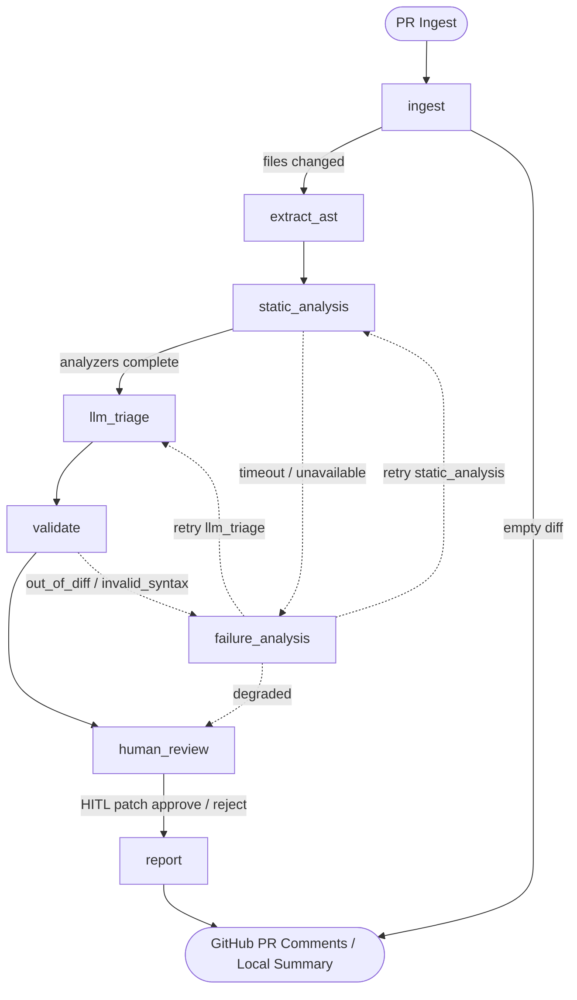

# CodeSentinel

**Autonomous DevSecOps agent for pull requests — deterministic AST/SAST first, LLM triage, verified patches.**

[](https://github.com/ancientdev0x/CodeSentinel/actions/workflows/ci.yml)
[](LICENSE)
[](docs/EVAL.md)

- **100% precision on benchmark:** 21/21 true positives, 0 false positives on clean control files across Python and TypeScript.
- **Cyclic LangGraph state machine with automatic degradation:** Bounded retries — out-of-diff findings are self-corrected by re-prompting; analyzer timeouts are retried, then degraded gracefully so the review still completes.
- **Patches validated before posting:** Surgical diffs tested with `git apply --check` and AST syntax checks; human-in-the-loop CLI (`--interactive`) and PR comments (`/codesentinel apply <id>`).

---

## Quickstart 🚀

Run a full offline deterministic review in under a minute without needing API keys or Docker:

```bash
git clone https://github.com/ancientdev0x/CodeSentinel.git
cd CodeSentinel && npm install
npm run demo
```

---

## Architecture & Review Engine ⚙️

CodeSentinel orchestrates reviews through a cyclic [LangGraph](https://github.com/langchain-ai/langgraphjs) state engine. Instead of dumping diffs into an LLM context window, it runs fast deterministic analyzers first, filters results through LLM triage, and isolates tool failures through bounded retries — out-of-diff findings are self-corrected by re-prompting; analyzer timeouts are retried, then degraded gracefully so the review still completes.



| Stage | Node | Description |
|---|---|---|
| **1. Ingest** | `ingest` | Clones PR / fetches diff (`git diff`), caps diff size (max 300 files), extracts modified line intervals. |
| **2. AST Extraction** | `extract_ast` | Parses language syntax trees via `ast-grep` (NAPI) and runs structural security pattern checks. |
| **3. Static Analysis** | `static_analysis` | Executes Bandit, Ruff, and `tsc` in network-less Docker sandboxes (with automatic host fallback). |
| **4. LLM Triage** | `llm_triage` | Filters detector false alarms, confirms real vulnerabilities, and catches subtle logic regressions. |
| **5. Validation** | `validate` | Validates findings against changed line ranges and verifies patch syntax via AST parsing. |
| **6. Failure Analysis** | `failure_analysis` | Handles timeouts or validation errors; routes into retry loops or marks stages as `degraded`. |
| **7. Human Review** | `human_review` | Generates `.patch` files validated with `git apply --check`; supports interactive CLI approval. |
| **8. Reporting** | `report` | Deduplicates comments by line interval and posts GitHub inline review comments + summary. |

---

## Empirical Evaluation & Benchmark 📊

CodeSentinel is evaluated against a 25-item ground-truth benchmark suite (`tests/fixtures/vuln-repo.labels.json`) covering 7 CWE categories, subtle logic regressions, and clean control files.

All metrics are recorded directly from raw JSON execution outputs in [**`eval-results/`**](eval-results/) across 3 live benchmark runs:

| Metric | Run 1 (Standard Review) | Run 2 (Forced Timeout Cycle) | Run 3 (Forced Timeout + Degraded Tracking) | 3-Run Benchmark Summary |
|---|---|---|---|---|
| **True Positives (TP)** | 20 / 21 | 21 / 21 | 20 / 21 | **95–100% recall (20.3 / 21, 96.8% avg)** |
| **False Positives (FP)** | 0 | 0 | 0 | **0 (100.0% precision)** |
| **Duplicate Detections** | 23 | 15 | 16 | **18 avg** |
| **Total Confirmed Findings** | 43 | 36 | 36 | **38.3 avg** |
| **False Negatives (FN)** | 1 | 0 | 1 | **0.7 avg** |
| **Precision** | 100.0% | 100.0% | 100.0% | **100.0%** |
| **Recall** | 95.2% (20/21) | 100.0% (21/21) | 95.2% (20/21) | **95–100% recall (96.8% avg)** |
| **Subtle Logic Regressions** | 2 / 3 caught | 3 / 3 caught | 2 / 3 caught | **7 of 9 caught across 3 runs (77.8%)** |
| **Clean Control False Positives** | 0 | 0 | 0 | **0% FP rate** |
| **Self-Correction Triggered** | No (all attempt 1) | Yes (`failure_analysis` cycle) | Yes (`failure_analysis` cycle) | **66.7% triggered (2 of 3 runs)** |
| **Self-Correction Recovered** | N/A | **False** (exhausted attempts, degraded) | **False** (exhausted attempts, degraded) | **0% (honest degraded account)** |
| **Degraded Stages** | 0 (`[]`) | 1 (`['llm_triage']`) | 4 (`['bandit', 'ruff', 'tsc', 'static_analysis']`) | Degraded stage tracking verified |
| **Patch Validity (`git apply --check`)** | 21 / 21 (100% valid diffs) | 0 generated | 0 generated | **100% of generated patches valid** |
| **Tokens (Total)** | 35,559 | 355,805 | 56,039 | Measured via OTel generation tokens |
| **Wall Clock Latency** | 89.8s (89,775 ms) | 145.7s (145,660 ms) | 74.9s (74,938 ms) | **89.8s median (~90s per review)** |

- Sourced from raw JSON runs: [`eval-results/full-run-1.json`](eval-results/full-run-1.json), [`eval-results/full-run-2.json`](eval-results/full-run-2.json), [`eval-results/full-run-3.json`](eval-results/full-run-3.json).
- See detailed methodology in [**docs/EVAL.md**](docs/EVAL.md).
- Inspect the live output on our benchmark pull request: [**ancientdev0x/codesentinel-demo#1**](https://github.com/ancientdev0x/codesentinel-demo/pull/1).

---

## Honest Limitations ⚠️

CodeSentinel is designed for surgical pull request reviews, but it has specific boundaries:

- **No Cross-File Taint Tracking:** Static analysis operates on single files and immediate ast-grep fragments. Inter-procedural taint propagation across deep module dependency graphs is not yet supported.
- **No Dynamic / Fuzz Analysis:** Findings are derived from AST pattern matching, static linters, and LLM reasoning. Code is not executed or fuzzed dynamically.
- **Docker Required for Production Analyzer Isolation:** In CI and local environments without Docker, CodeSentinel falls back to host execution (`CodeSentinel_SANDBOX=host`). For untrusted PR code, Docker with `--network none` and `--read-only` is required to ensure sandbox safety.
- **Single-Repository Scope:** Reviews evaluate changes within the target Git repository; cross-repository dependencies and microservice boundary contracts are outside current scope.

---

## Core Features & Usage 🛠️

### 1. Ingest Public or Private PR URLs
Review any GitHub pull request directly by URL without manual checkout:

```bash
npx CodeSentinel review --pr https://github.com/owner/repo/pull/123
```

CodeSentinel clones the PR head into an ephemeral temporary directory, resolves the base SHA, reviews the diff, and cleans up after execution.

### 2. AST Pattern Matching & Structural Security Rules
CodeSentinel uses `@ast-grep/napi` to parse code into abstract syntax trees and match structural security anti-patterns across Python and TypeScript:
- `py-eval-exec`: Unsafe dynamic execution (`eval()`, `exec()`) [CWE-95]
- `py-sql-concat`: Raw SQL string concatenation and formatted queries [CWE-89]
- `py-subprocess-shell`: Subprocess execution with `shell=True` [CWE-78]
- `py-pickle-loads`: Insecure deserialization via `pickle.loads()` [CWE-502]
- `py-yaml-unsafe`: Insecure YAML loading without `SafeLoader` [CWE-502]
- `ts-eval`: Unsafe `eval()` or `new Function()` in TypeScript [CWE-95]
- `ts-child-exec-template`: Unsanitized command injection in template literals [CWE-78]
- `ts-innerhtml`: Dynamic non-literal assignment to `innerHTML` [CWE-79]
- `ts-hardcoded-secret`: Hardcoded secrets and credentials [CWE-798]

**Adding Custom Rules:** Simply place a new YAML rule in `src/review/ast/rules/<rule-id>.yml`. Rules define an AST `pattern`, language (`python` or `typescript`), `message`, and `cwe`.

### 3. Sandboxed Static Analyzers (Docker & Timeout Isolation)
Static analyzers (Bandit 1.8.3, Ruff 0.9.10, and TypeScript 5.8.2) run in a hardened, network-less Docker container (`codesentinel-analyzers:0.1.0`):
- **Isolation Flags:** `--network none`, `--read-only`, `--cap-drop all`, `--user 10001:10001`, `--memory 1g`.
- **Hard Timeout:** `CodeSentinel_ANALYZER_TIMEOUT_MS` (default 60s) kills hung subprocesses cleanly.
- **Automatic Fallback:** If Docker is unavailable or the daemon is unreachable, CodeSentinel automatically falls back to host execution.

```bash
# Force host execution if Docker is not installed
CodeSentinel_SANDBOX=host npx CodeSentinel review
```

### 4. Self-Correcting Cyclic Recovery
When tools fail or LLMs hallucinate invalid line references, the LangGraph engine intercepts the error using bounded retries — out-of-diff findings are self-corrected by re-prompting; analyzer timeouts are retried, then degraded gracefully so the review still completes:

| Error Kind | Cause | Self-Correction Recovery Action |
|---|---|---|
| `timeout` | Analyzer exceeded deadline | Doubled timeout allocation and retries `static_analysis`. |
| `out_of_diff` | Finding line outside PR diff | Injects validation hint back to `llm_triage` to re-bound lines. |
| `unavailable` | Docker daemon error | Degrades sandbox backend to `host` and retries execution. |
| `max_attempts` | Exceeded 3 retry attempts | Marks failing stage as `degraded` and proceeds to reporting. |

### 5. Human-in-the-Loop & Unified Diff Patches
CodeSentinel generates surgical unified diff patches (`.CodeSentinel/patches/<id>.patch`) for confirmed findings:
- **Bounded Patches:** Every patch is strictly capped at $\le 60$ lines modified.
- **Pre-validated:** Patches are tested against the workspace using `git apply --check` and syntax-validated before presentation.
- **Interactive CLI Approval:**
  ```bash
  npx CodeSentinel review --interactive
  ```
  Suspends execution via LangGraph `interrupt()`, presents diffs in the terminal, and prompts to `[a]pply`, `[r]eject`, or `[e]dit`.
- **GitHub PR Commands:**
  Comment on any PR where CodeSentinel posted a patch:
  ```text
  /codesentinel apply a1b2c3d4
  /codesentinel reject a1b2c3d4
  ```
  Protected against unauthorized actors, fork PR tampering, stale commit SHAs, and path traversal.

### 6. Full Distributed Tracing with Langfuse
Every review run exports comprehensive OpenTelemetry traces to [Langfuse](https://langfuse.com/):
- Root review trace with duration, PR metadata, and total token cost.
- Span per LangGraph node (`extract_ast`, `static_analysis`, `llm_triage`, `validate`).
- Child spans for every tool call and subprocess execution (exit codes, timeouts, execution duration).
- Generation observations with exact prompt/completion token details and reasoning token tracking.

```bash
export LANGFUSE_PUBLIC_KEY="pk-lf-..."
export LANGFUSE_SECRET_KEY="sk-lf-..."
export LANGFUSE_BASEURL="https://cloud.langfuse.com"
```

---

## Setup & CI/CD Integration 🚀

### GitHub Action

Add CodeSentinel to your repository workflows:

```yaml
# .github/workflows/CodeSentinel.yml
name: CodeSentinel

on:
  pull_request:

permissions:
  pull-requests: write
  contents: read

jobs:
  review:
    runs-on: ubuntu-latest
    steps:
      - uses: actions/checkout@v4
        with:
          fetch-depth: 0
      - uses: ancientdev0x/CodeSentinel@v0
        env:
          GITHUB_TOKEN: ${{ secrets.GITHUB_TOKEN }}
          OPENAI_API_KEY: ${{ secrets.OPENAI_API_KEY }}
```

### Local Review

Review staged changes (`git diff --cached`) locally:

```bash
npx CodeSentinel review
```

---

## Documentation 📚

- [Evaluation & Benchmarks](docs/EVAL.md) — Empirical precision, recall, and latency metrics
- [Architecture](docs/ARCHITECTURE.md) — System diagrams, LangGraph nodes, and data flow
- [Configuration Reference](docs/CONFIGURATION.md) — Complete environment variable reference
- [Setup Guide](docs/setup.md) — CI/CD and local development guide
- [Model Providers](docs/ai-provider-config.md) — Anthropic, OpenAI, OpenRouter, and Cloudflare Workers AI
- [Model Context Protocol (MCP)](docs/mcp.md) — Connect remote MCP servers
- [Rules & Project Context](docs/rules-files.md) — Inject AGENTS.md, CLAUDE.md, and Agent Skills
- [On-Demand Review](docs/tag-CodeSentinel.md) — Trigger reviews via `/codesentinel` comments

---

## License

MIT © 2026 CodeSentinel contributors. See [LICENSE](LICENSE) for details.
