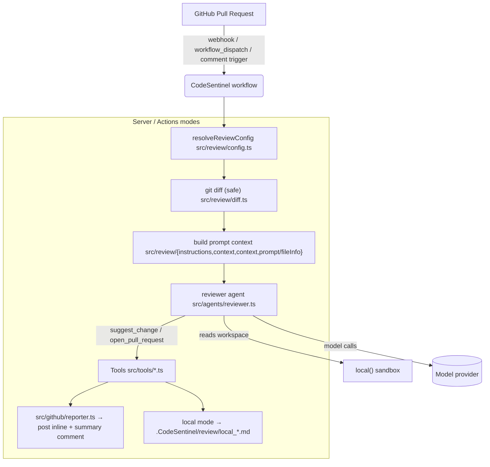
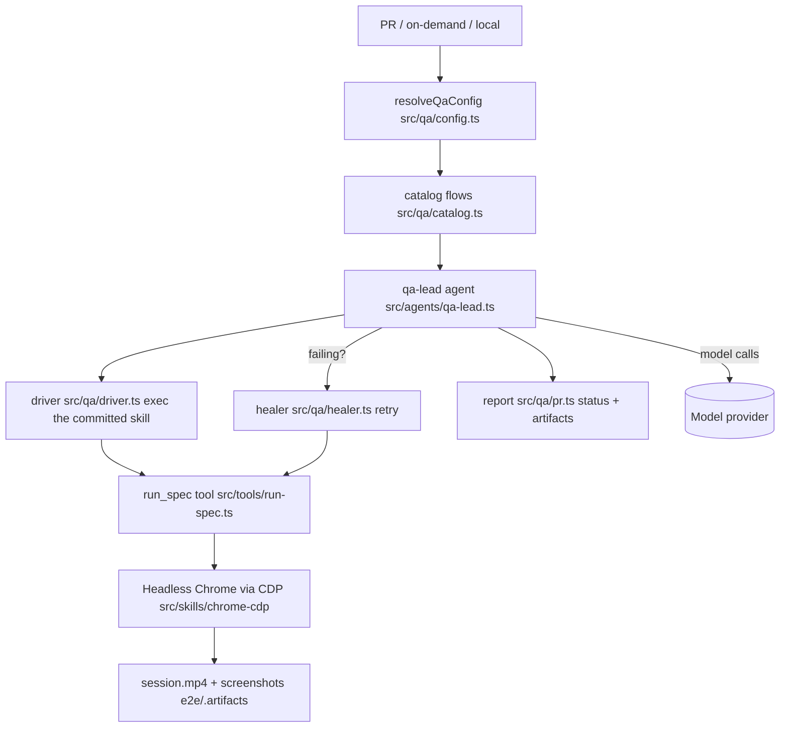

# Architecture

This document describes how CodeSentinel is structured at runtime. Source evidence is
cited inline. For the public interfaces (HTTP routes, CLI, and GitHub Action) see
[API and Usage](./API.md); for environment variables see
[Configuration](./CONFIGURATION.md).

## 1. System context

CodeSentinel is a flue-based agent system. The flue runtime owns the agent loop and
the HTTP server; `src/` contributes the agents, workflows, tools, and channels that
flue discovers and wires up.

```mermaid
graph TD
  subgraph ext["External actors & services"]
    GH["GitHub (PRs, comments, webhooks)"]
    Model["Model provider<br/>Anthropic / OpenAI / OpenRouter / Cloudflare"]
    User["Developer / CI runner"]
    MCP["Remote MCP servers"]
    Tel["Telemetry endpoint<br/>(anonymous, opt-out)"]
  end

  subgraph repo["CodeSentinel repository"]
    CLI["bin/CodeSentinel.mjs<br/>(flue CLI entrypoint)"]
    Flue["flue runtime<br/>(agent loop + HTTP server)"]
    Rev["Workflow: review<br/>src/workflows/review.ts"]
    QA["Workflow: qa<br/>src/workflows/qa.ts"]
    RevA["Agent: reviewer<br/>src/agents/reviewer.ts"]
    QAL["Agent: qa-lead<br/>src/agents/qa-lead.ts"]
    Ment["Agent: mention<br/>src/agents/mention.ts"]
    Tool["Tools<br/>src/tools/*.ts"]
    Chan["Channel: github<br/>src/channels/github.ts"]
    Patch["Reporter<br/>src/github/reporter.ts"]
    Review["Review internals<br/>src/review/*"]
    QAmod["QA module<br/>src/qa/*"]
    Connect["MCP connect<br/>src/mcp/connect.ts"]
    Common["Common<br/>src/common/*"]
  end

  User -->|"npx CodeSentinel ..."| CLI
  CLI --> Flue
  Flue -- discovers/runs --> Rev & QA
  Rev --> RevA
  QA --> QAL
  QA --> Ment
  RevA -- tools --> Tool
  QAL -- tools --> Tool
  QAL -- uses --> QAmod
  QAL -- CDP via --> MCP
  QAmod -- chrome-cdp --> Browser["Headless Chrome<br/>(Chrome DevTools Protocol)"]
  Tool --> Connect
  Connect --> MCP
  RevA --> Review
  QA --> QAmod
  Flue --> Chan
  Chan --> GH
  RevA -- suggest_comment/OpenPR --> Patch
  Patch --> GH
  Common --> Tel
  RevA -- model calls --> Model
  QAL -- model calls --> Model
  QAmod -- browser --> Browser
  Flue -->|.CodeSentinel/review/ (local)| User
  classDef repo fill:#eef,stroke:#479;
  classDef ext fill:#ffe,stroke:#aa4;
  class CLI,Flue,Rev,QA,RevA,QAL,QAmod,Tool,Chan,Patch,Review,QMod,Connect,Common,Ment,Patch fill:#eef,stroke:#479;
  class User,GH,Model,MCP,Tel,Browser fill:#ffe,stroke:#aa4;
```

### What problem does this solve?

Maintaining code quality and end-to-end behavior in a repo is two separate,
error-prone jobs: **human review** catches logic/design issues but is slow and
inconsistent, while **automated tests** catch regressions but rarely explore the
product from a user's perspective. CodeSentinel automates **both**:

- The **review workflow** runs a model over the PR diff with real dev tools (git, file
  reads, the web/dev-skill MCP tools) and posts inline review comments — like a human
  reviewer, but in CI/on-demand.
- The **QA workflow** goes further: it autonomously **writes and executes a black-box
  spec** against the running product (web or CLI), driving a real headless browser via
  the Chrome DevTools Protocol, and **self-heals** failing specs.

### Who uses it?

- Repo maintainers configuring the `CodeSentinel` GitHub Action (`action.yml`).
- Developers who comment `/CodeSentinel review` on a PR, or run the workflow locally.
- QA engineers authoring committed browser/CLI specs in `src/skills/` that the agent
  runs; and authors who want the agent to write a fresh black-box spec for a PR.

## 2. Runtime architecture

### Entry points

| Entry point | File | What it does |
| --- | --- | --- |
| `npx CodeSentinel init` | `bin/CodeSentinel.mjs` | Scaffolds `.github/workflows/CodeSentinel.yml` from `bin/templates/{review,qa,fanout}.yml` + a sample workflow file. |
| `npx CodeSentinel review` / `qa` | `bin/CodeSentinel.mjs` | Runs the `review`/`qa` workflow locally against staged changes (`flue run review/qa --target node`). |
| Built server | `dist/server.mjs` (flue build of `src/`) | Serves the workflow routes (`POST /workflows/review`, `/workflows/qa`) and the GitHub channel (`POST /channels/github/webhook`). Flue auto-discovers workflows/agents/tools/channels/skills in `src/` — there is no app entry file. |
| Telemetry API | `apps/server/src/index.ts` | Tiny HTTP API `POST /events` on the `CodeSentinel-telemetry` Cloudflare Worker. |
| `apps/www` | `apps/www/src/routes.tsx` | Marketing landing page. |

The package ships `dist/server.mjs` (built once, via `flue build --target node`);
runtime never invokes `flue` (see [Deployment](./DEPLOYMENT.md)).

### Workflow orchestration

Both workflows follow the same flue shape — `defineWorkflow({ agent, input, run })`
(`src/workflows/review.ts`, `src/workflows/qa.ts`), and each exports `route` so flue
serves `POST /workflows/<name>` automatically.

**Review workflow** (`src/workflows/review.ts`):
`input` (valibot schema) → `resolveReviewConfig` (`src/review/config.ts`) → compute git
diff (`src/review/diff.ts`) → build prompt context (inject `AGENTS.md`/`CLAUDE.md`
from the workspace root + the diff + per-file info from `src/review/prompt/fileInfo.ts`)
→ run the `reviewer` agent (`src/agents/reviewer.ts`) with `suggest_change` +
`open_pull_request` tools → report via `src/github/reporter.ts` (GitHub Octokit, or
`.CodeSentinel/review/local_*.md` in local mode).

**QA workflow** (`src/workflows/qa.ts`):
`input` (valibot) → `resolveQaConfig` (`src/qa/config.ts`, which reuses the review
resolver) → `catalog` flows (`src/qa/catalog.ts`) → `qa-lead` agent orchestrates a
`driver` (`src/qa/driver.ts`) that `exec`s the committed skill (`src/qa/skill.ts`),
drives Chrome via CDP (`src/skills/chrome-cdp/`, the `run_spec` tool), and `healer`s
retries (`src/qa/healer.ts`) → reports PR status + artifacts via `src/qa/pr.ts`.

### The reviewer agent

`src/agents/reviewer.ts` constructs the reviewer with `createAgent`:
- model: centralised via `src/common/models.ts` (`CodeSentinel_MODEL` →
  `anthropic/claude-sonnet-4-6`).
- environment: `local()` sandbox (reads files in the workspace).
- instructions: from `src/review/instructions.ts` (which injects the repo's
  `AGENTS.md`/`CLAUDE.md` and the system prompt).
- tools: `suggest_change` (`src/tools/suggest-change.ts`) and `open_pull_request`
  (`src/tools/open-pull-request.ts`), each defined with a valibot input schema.

### The QA agent ecosystem

`src/agents/qa-lead.ts` is the planner/healer; `src/agents/mention.ts` implements the
`/CodeSentinel qa` on-demand entry point. The heavy lifting lives in `src/qa/`:
`catalog` (test-flow discovery), `pr-policy` (which flows to gate on / run),
`driver` (exec the committed skill), `healer` (retry logic), `pr` (status +
artifacts), `skill` (the agent-skill contract). The committed, runnable specs live in
`src/skills/` (agent-discoverable) and user project skills in `.agents/skills/`.

### Channels: how GitHub events enter

`src/channels/github.ts` implements the GitHub channel for flue:
- Webhook receiver: `POST /channels/github/webhook`, verifying the signature with
  `GITHUB_WEBHOOK_SECRET` (falls back to a per-process random secret → fails closed),
  then dispatches to flue (`@flue/github`).
- This is what the "webhook channel" deploy mode uses (a long-running server that is
  **triggered by GitHub** but never checks out PR code itself).

### Reporting / output

`src/github/reporter.ts` is the single sink for review results:
- GitHub mode → posts an inline `suggest_change` comment per suggestion + a summary
  PR comment via Octokit.
- Local mode → writes `.CodeSentinel/review/local_<timestamp>.md` (and `local_summary.md`)
  and a `.gitignore`.

### Skills discovery

- Committed skills: `src/skills/**/SKILL.md` — auto-discovered by flue.
- User project skills: `.agents/skills/**/SKILL.md` — auto-discovered from the
  workspace root, so they run in the caller's project (e.g. an app's own CDP helpers).

## 3. Component / directory map

```
bin/
  CodeSentinel.mjs        # CLI: init, review, qa, configure        (entry: npx CodeSentinel)
  templates.mjs           # scaffolded workflow templates
  templates/{review,qa,fanout}.yml
src/
  (flue auto-discovers src/workflows, src/agents, src/tools, src/channels, src/skills — no app entry file)
  workflows/{review,qa}.ts # one-shot workflows; export `route` (POST /workflows/<name>)
  agents/{reviewer,qa-lead,mention}.ts
  tools/{suggest-change,catalog-flows,classify-finding,open-pull-request,run-spec}.ts
  review/                 # reviewer prompt: config, diff, instructions, context,
                          #   constants, prompt/fileInfo, utils/filterFiles
  qa/                     # qa-lead + drivers: config, catalog, driver, exec,
                          #   healer, instructions, pr-policy, pr, skill, cli-client.mjs
  channels/github.ts      # GitHub webhook channel (flue channel)
  github/reporter.ts      # post comments / write .CodeSentinel/review/
  mcp/connect.ts          # connect remote MCP servers
  common/{models,telemetry,types,formatting/summary}.ts
  skills/{chrome-cdp,}/SKILL.md   # committed skills (auto-discovered)
apps/
  server/src/index.ts     # telemetry API: POST /events
  server/func             # worker handler
  www/src/routes.tsx      # marketing page
qa/                       # the qa composite GitHub Action (qa/action.yml)
tests/                    # Vitest specs mirroring src/
```

## 4. Data flow: review



## 5. Data flow: QA



## 6. Authentication & authorization flow

1. **CI review** — the composite action injects the caller's `GITHUB_TOKEN`
   (`action.yml:84-89`) → `resolveReviewConfig` (`src/review/config.ts:120`) builds
   Octokit → comments posted as the token actor.
2. **Webhook channel** — `POST /channels/github/webhook` verifies `GITHUB_WEBHOOK_SECRET`
   (`src/channels/github.ts:35-36`); absent secret → fails closed (rejects all).
3. **On-demand `/CodeSentinel` comment** — `CodeSentinel-mention.yml` gates on
   non-bot + `author_association` allowlist before running.
4. **Telemetry** — anonymous, opt-out (`CodeSentinel_TELEMETRY=false`).

## 7. Deployment topology

- **Recommended (GitHub Actions)** — no server. `action.yml` runs the review in CI;
  `qa/action.yml` runs QA. See [Deployment](./DEPLOYMENT.md).
- **Server mode** — `node dist/server.mjs` is a single Node process that serves the
  workflow routes, the GitHub channel, and (locally) the telemetry endpoint. Deploy it
  behind a TLS-terminating proxy; set `GITHUB_WEBHOOK_SECRET` and `PORT`.
- **Telemetry API** — `apps/server` is a separate Cloudflare Worker
  (`POST /events`) used for anonymous telemetry; independent of the main server.

## 8. Security considerations

See [SECURITY.md](../SECURITY.md). Highlights:
- git diffs are computed safely (`src/review/diff.ts`) — no shell injection.
- Tool inputs are valibot-validated.
- the telemetry endpoint is intentionally unauthenticated + CORS `*` (anonymous ingest).
- the Docker image runs Chrome `--no-sandbox` as root (container-only; recommendation: non-root).
- QA recordings may capture typed input/credentials; gitignore them in production runs.

## 9. Architectural tradeoffs

- **Single process, no DB** — the flue server keeps no persistent state; diffs are read
  from git at request time. This makes the service stateless and easy to deploy, at the
  cost of recomputing the diff per run.
- **Model calls for orchestration** — both the reviewer and the QA catalog/driver are
  LLM-driven rather than rule-based, which gives broad coverage but makes runs
  non-deterministic and usage-based (see limitations).
- **Agent-driven QA over fixed tests** — QA writes a fresh black-box spec per target,
  complementing (not replacing) the committed `src/skills/*` specs.
- **Framework coupling** — this repo is a flue application; its workflows, agents, and
  tools use the `@flue/runtime`/`@flue/cli` APIs (valibot schemas, `defineWorkflow`,
  `createAgent`), so it is versioned with those packages.

## 10. Known limitations

- Non-deterministic: identical inputs can produce different review/QA output.
- Usage-based cost: every review/QA run calls a model — set budgets/thinking levels
  accordingly.
- QA needs real browser access; local runs require Chrome/Chromium.
- Cross-repo QA and on-demand `/CodeSentinel` triggers require a configured webhook
  channel or mention workflow.
- No formal supported-versions/LTS policy; latest release + `main` receive fixes.

## 11. Key APIs by file

| Concern | File(s) |
| --- | --- |
| Config (review + QA share) | `src/review/config.ts`, `src/qa/config.ts` |
| Model resolution | `src/common/models.ts` |
| Diff computation | `src/review/diff.ts` |
| Prompt context | `src/review/instructions.ts`, `src/review/context.ts`, `src/review/prompt/fileInfo.ts` |
| Reviewer agent + tools | `src/agents/reviewer.ts`, `src/tools/*` |
| Reporting | `src/github/reporter.ts` |
| QA orchestration | `src/workflows/qa.ts`, `src/agents/qa-lead.ts`, `src/qa/*` |
| Channels/webhook | `src/channels/github.ts` |
| MCP | `src/mcp/connect.ts` |
| Telemetry | `src/common/telemetry.ts`, `apps/server/src/index.ts` |
